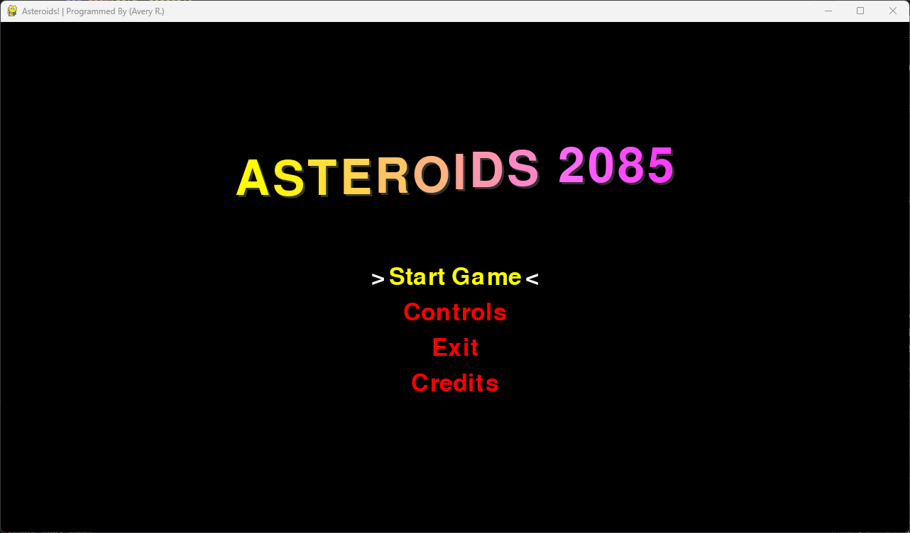

# ASTEROIDS 2085 (WIP)

Built with pygame 2.6.1, SDL 2.28.4, Python 3.12.3, &amp; Some Love ™️💯

## How to play

### In Main Menu

* To Navigate &amp; Select Menus (*NOTE:* HOLD THE [ L-SHIFT ] *KEY DOWN* WHEN REQUIRED):
        - Use [ L-SHIFT ] + [ W ] or [ ARROW_UP ] &amp; [ L-SHIFT ] + [ S ] or [ ARROW_DOWN ] keys to navigate 'UP' &amp; 'DOWN'.
        - Press [ ENTER ] or [ L-SHIFT ] + [ E ] to select an option.

### In Game

* Use [ W ], [ A ], [ S ], [ D ] keys (up, left, down, &amp; right) respectively to move the ship.
* Press/Hold the [ SPACEBAR ] to shoot.
* Press the [ ESC ] key to pause the game.

## Main Menu State

* she so sleeeeeeeek

## Gameplay State (WIP)

* I want to add a lot more to this project. Time will only tell what that will be though! :)
