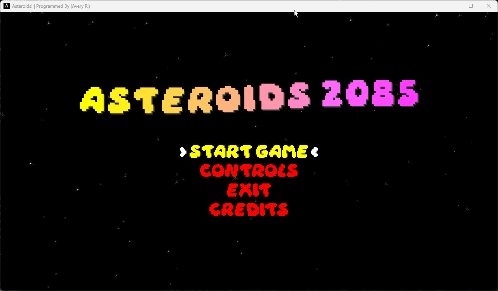
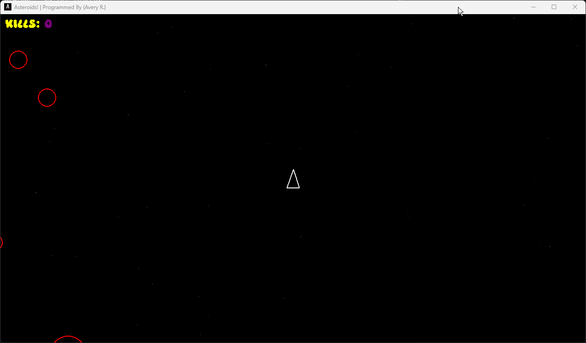

# ASTEROIDS 2085 (WIP) [](https://github.com/XeCrash/Asteroids_2085/actions/workflows/asteroids-ci-builds.yml)

Built with pygame 2.6.1, SDL 2.28.4, Python 3.12.3, &amp; Some Love ™️💯

## Requirements

- Install [**Python Language**](https://python.org/downloads/) >= 3.10
- Install [**requirements.txt**](requirements.txt) | Needed Dependencies.

To install the required game dependencies from **requirements.txt**, run the following command:

```CLI
pip install -r requirements.txt
```

## Documentation

Project documentation is available in the [**`docs`**](docs/src) directory. To view the documentation:

1. Clone the repository
2. Browse to the **`docs`** folder
3. Open **`index.html`** in a browser of choice for a comprehensive reference

To generate updated documentation from the latest code use pdoc within root of the ./src directory:

```CLI
pdoc . --html -o ../docs --force
```

See **`docs/How_To_Generate_Docs.md`** for more details. (NOT ADDED YET)

## How to play

### In Main Menu

To Navigate &amp; Select Menus (*NOTE:* HOLD THE [ L-SHIFT ] *KEY DOWN* WHEN REQUIRED):

- Use [ L-SHIFT ] + [ W ] or [ ARROW_UP ] key(s) to navigate '⬆️(UP)'
- Use [ L-SHIFT ] + [ S ] or [ ARROW_DOWN ] key(s) to navigate '⬇️(DOWN)'
- Press [ ENTER ] or [ L-SHIFT ] + [ E ] key(s) to select an option.

### In Game

- Use [ W ], [ A ], [ S ], [ D ] keys (⬆️up, ⬅️left, ⬇️down, &amp; ➡️right) respectively to move the ship.
- Press/Hold the [ SPACEBAR ] to shoot.
- Press the [ ESC ] key to end the current game and return to the main menu (it will be a pause button eventually)

## Main Menu State

- she so sleeeeeeeek


## Gameplay State (WIP)

- I want to add a lot more to this project. Time will only tell what that will be though! :)

